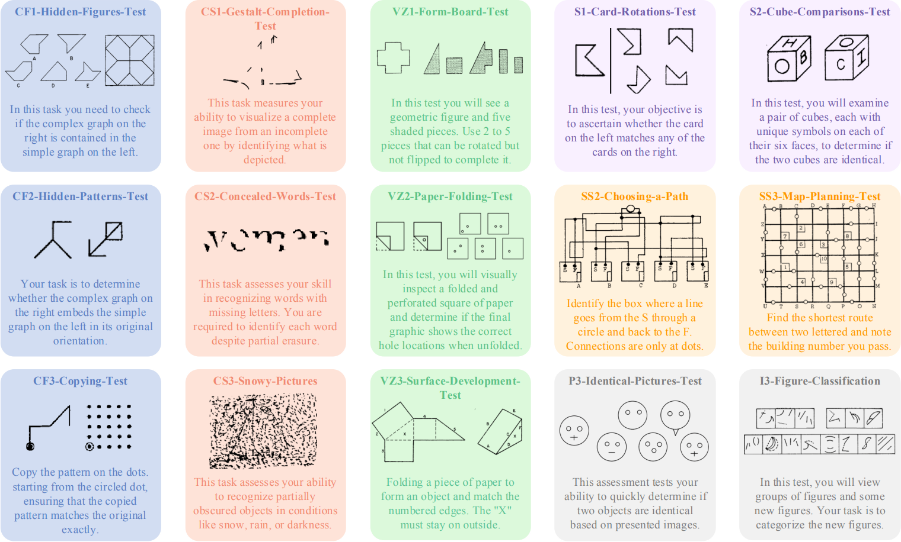

    <h1> VisFactor</h1>

## Leaderboard

|  **CF1**   | **GPT\-4o SCoT** | **GPT\-4o Vanilla** | **GPT\-4o CoT** | **Gemini\-1\.5\-Pro CoT** | **Gemini\-2\.0\-Flash\-Vanilla** | **Gemini\-1\.5\-Pro Vanilla** | **Gemini\-2\.0\-Pro Vanilla** | **Gemini\-2\.0\-Pro CoT** | **GPT\-4o MAD** | **Gemini\-2\.0\-Flash\-CoT** | **Qwen\-VL\-Max CoT** | **Gemini\-1\.5\-Flash\-Vanilla** | **Qwen\-VL\-Max Vanilla** | **Gemini\-1\.5\-Flash\-CoT** | **Random** |
| :--------: | :--------------: | :-----------------: | :-------------: | :-----------------------: | :------------------------------: | :---------------------------: | :---------------------------: | :-----------------------: | :-------------: | :--------------------------: | :-------------------: | :------------------------------: | :-----------------------: | :--------------------------: | :--------: |
| **CF1\-S** |      28\.1       |        21\.9        |      15\.6      |           21\.8           |              15\.6               |             6\.3              |             18\.8             |            25             |      18\.8      |            28\.1             |         31\.3         |              18\.8               |           9\.4            |            18\.8             |     20     |
|  **CF2**   |      55\.6       |        56\.3        |      40\.6      |           35\.6           |              23\.8               |             33\.8             |             51\.2             |           15\.6           |       65        |              25              |         71\.3         |              53\.8               |           62\.5           |            26\.3             |     50     |
| **CF2\-S** |      65\.5       |         58          |      55\.8      |           58\.3           |                51                |             56\.8             |             53\.5             |           49\.5           |      26\.4      |            49\.5             |         53\.3         |              49\.5               |            51             |            46\.5             |     50     |
|  **CF3**   |      65\.5       |         66          |      66\.8      |           48\.3           |              37\.8               |              51               |              57               |             8             |      49\.8      |              24              |         53\.3         |                0                 |            58             |              0               |     50     |
|  **CS1**   |       7\.8       |        1\.6         |      10\.9      |           14\.1           |               4\.7               |             1\.6              |             6\.3              |           1\.6            |      3\.1       |             1\.7             |           0           |               3\.1               |           6\.3            |             4\.7             |     4      |
|  **CS2**   |        30        |         35          |       30        |            25             |                25                |              20               |              10               |            20             |        5        |              20              |          10           |                15                |            10             |              25              |     \-     |
|  **CS3**   |        20        |         26          |       22        |            18             |                6                 |               0               |              10               |             2             |       16        |              4               |           6           |                0                 |             8             |              0               |     \-     |
|  **VZ1**   |        25        |        20\.8        |      33\.3      |           20\.8           |               8\.3               |             12\.5             |             8\.3              |           4\.2            |      12\.5      |             8\.3             |         4\.2          |               4\.2               |           8\.3            |              0               |     \-     |
|  **VZ2**   |      65\.8       |        63\.3        |      62\.9      |           66\.3           |              60\.8               |             70\.4             |             62\.1             |           61\.3           |      41\.3      |            63\.3             |         62\.1         |              53\.3               |           60\.4           |            55\.4             |     50     |
| **VZ2\-S** |        30        |         35          |       15        |            15             |                25                |              20               |              10               |            10             |       40        |              10              |          15           |                20                |            15             |              20              |     20     |
|  **VZ3**   |        67        |         80          |       71        |            20             |                28                |              18               |              56               |            28             |       55        |              30              |          22           |                15                |            26             |              10              |     50     |
| **VZ3\-S** |      36\.7       |        36\.7        |      31\.7      |           31\.7           |              21\.7               |             21\.7             |             26\.7             |            30             |      23\.3      |              20              |         33\.3         |                15                |            30             |            11\.7             |   14\.6    |
|   **S1**   |      38\.3       |         30          |      33\.3      |           11\.7           |              23\.3               |             16\.7             |              25               |            15             |       15        |              25              |          25           |              11\.7               |           26\.7           |            11\.7             |   14\.6    |
| **S1\-S**  |        50        |         50          |       50        |           49\.4           |              46\.9               |              50               |             47\.5             |           56\.3           |      43\.8      |            51\.2             |         47\.5         |              47\.5               |           46\.9           |            46\.3             |     50     |
|   **S2**   |      53\.8       |        56\.3        |      54\.4      |           49\.4           |              46\.9               |              50               |             47\.5             |           56\.3           |      43\.1      |            51\.2             |         58\.1         |              47\.5               |           46\.9           |            46\.3             |     50     |
|  **SS2**   |      57\.1       |        52\.4        |      52\.4      |           52\.4           |              52\.4               |             40\.5             |              50               |           38\.1           |      47\.6      |            54\.8             |         38\.1         |              52\.4               |           42\.9           |            45\.2             |     50     |
|  **SS3**   |      21\.9       |         25          |      18\.8      |           15\.6           |              28\.1               |             34\.4             |             28\.1             |           34\.4           |      28\.1      |            18\.8             |         18\.8         |              28\.1               |           21\.9           |              25              |     20     |
| **SS3\-S** |        30        |         30          |      27\.5      |            30             |               7\.5               |             12\.5             |              15               |            15             |       25        |             7\.5             |          20           |                15                |             5             |              0               |    9\.1    |
|   **P3**   |        30        |         25          |       30        |            10             |               7\.5               |              15               |             12\.5             |           22\.5           |       10        |            17\.5             |          15           |                15                |           22\.5           |              10              |    9\.1    |
| **P3\-S**  |      40\.6       |        44\.8        |      20\.8      |           20\.8           |              20\.8               |              26               |              25               |            25             |      41\.7      |            22\.9             |          24           |              14\.6               |           22\.9           |            12\.5             |     20     |
|   **I3**   |      93\.1       |        91\.9        |      90\.4      |            64             |              69\.2               |             76\.9             |             77\.7             |           60\.8           |       74        |            77\.7             |          70           |              74\.2               |           68\.5           |            79\.8             |     50     |
| **I3\-S**  |      53\.5       |        55\.8        |       46        |           20\.8           |              51\.3               |             51\.8             |             53\.1             |           48\.7           |      39\.3      |            51\.3             |         35\.7         |              43\.3               |           32\.6           |            42\.4             |   42\.9    |
| **Avg\.**  |      36\.6       |        43\.8        |      39\.3      |           34\.4           |                50                |             34\.8             |             31\.3             |           21\.4           |      43\.8      |            30\.4             |         25\.9         |              40\.6               |           34\.4           |            13\.8             |   42\.9    |

